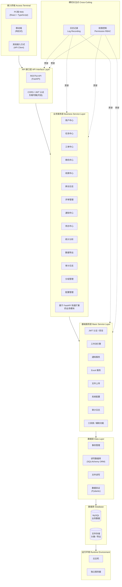
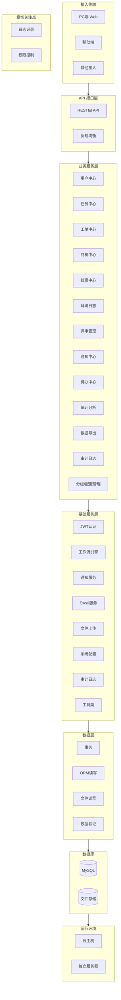

# AI Store FDE支撑系统 - 系统架构图（Mermaid）

> 格式参考分层架构图，内容为本系统（工单管理与商机跟踪）实际模块，含横切关注点。

## 系统分层架构图

## 简化版（无连线，仅分层）

若渲染环境对连线支持不佳，可使用下方仅分层、无横切连线的版本：

## 图例说明

| 层级 | 说明 |
|------|------|
| **接入终端** | PC 端为 React 单页应用，移动端为响应式 Web，支持其他 API 调用方。 |
| **API 接口层** | FastAPI 提供 RESTful API，CORS、JWT 认证及可选负载均衡。 |
| **业务服务层** | 用户、任务、工单、商机、线索、拜访日志、评审、通知、待办、统计、导出、审计、分组、配置及可扩展业务模块。 |
| **基础服务层** | 认证、工作流、通知、Excel、上传、配置、审计、工具等支撑能力。 |
| **数据层** | 事务、ORM 读写、文件读写、Pydantic 校验。 |
| **数据库** | MySQL 持久化业务数据，文件存储用于头像与导出文件。 |
| **运行环境** | 支持云主机或独立服务器部署。 |
| **横切关注点** | 日志记录、权限控制（RBAC）贯穿 API、业务、基础服务等层。 |

---

**系统名称**: AI Store FDE支撑系统  
**系统定位**: 工单管理与商机跟踪  
**文档版本**: v1.0.0
